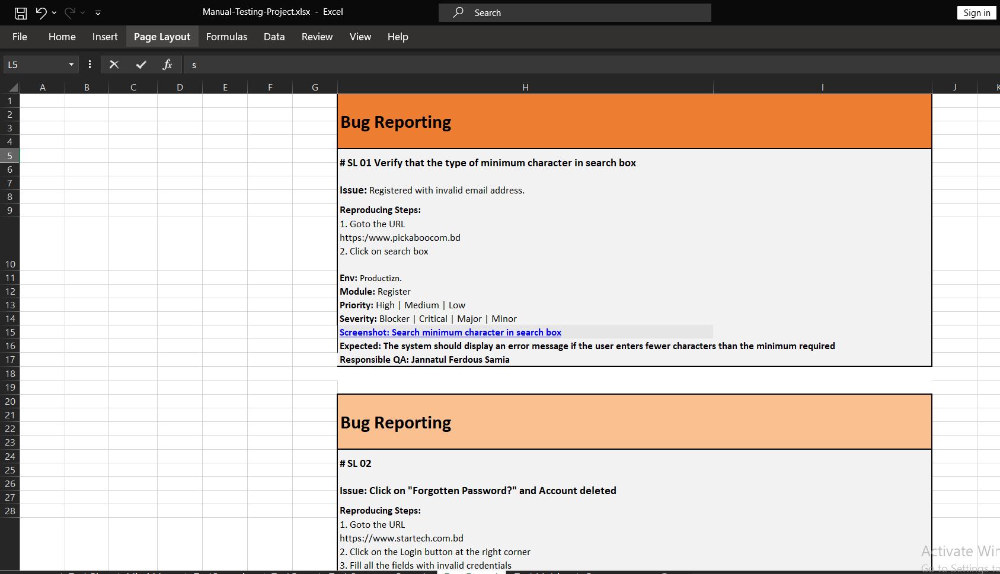
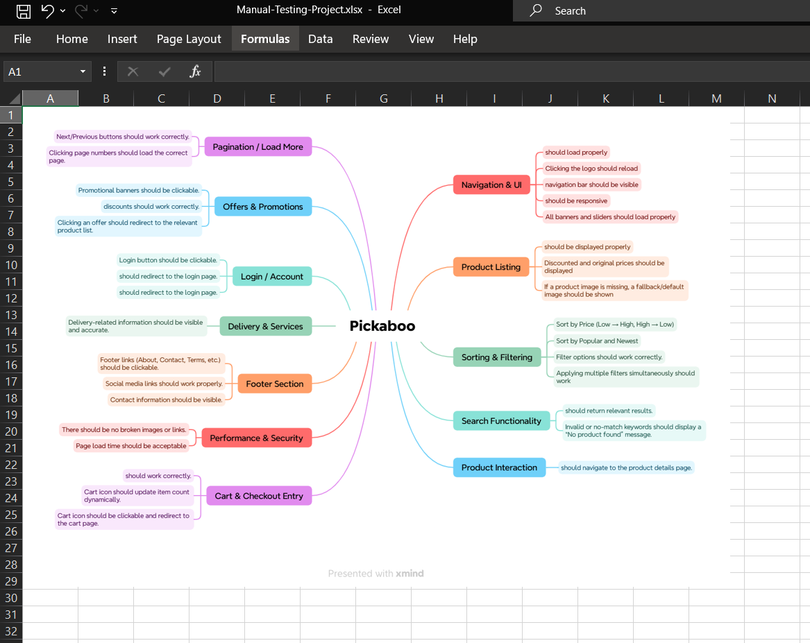
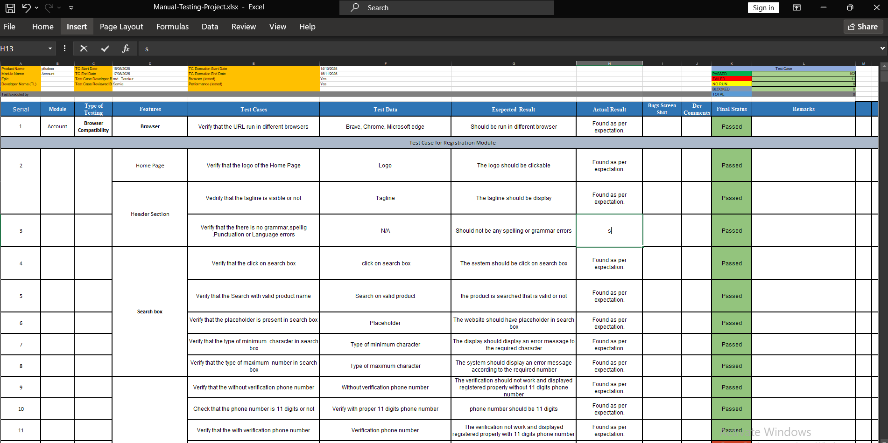
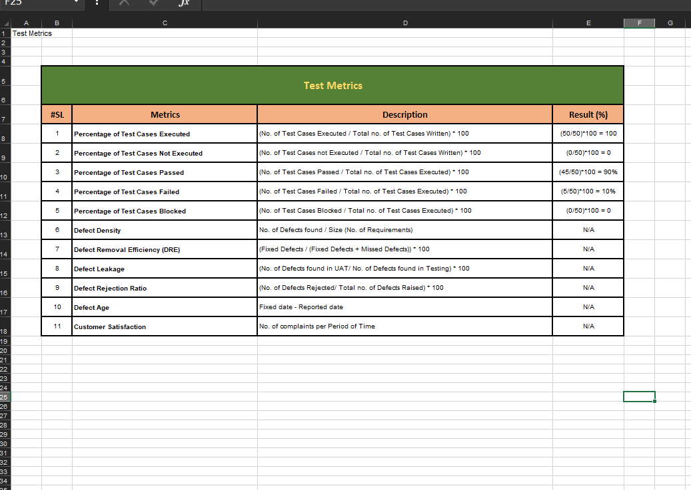
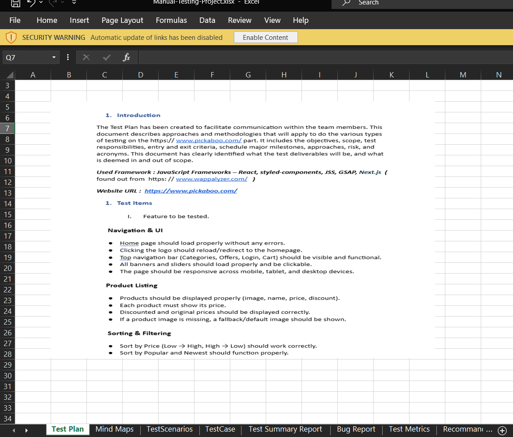
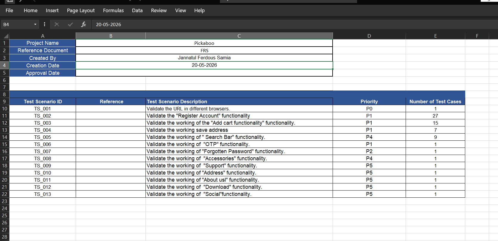
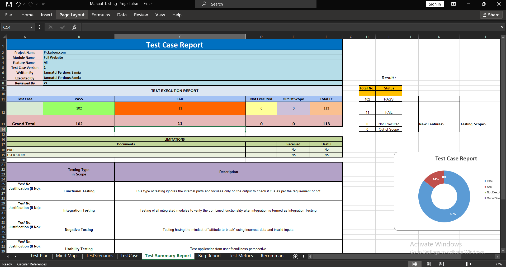

# Pickaboo-Manual-Testing-Project
Manual testing project performed on Pickaboo e-commerce website. Includes test plan, test scenarios, test summary report test cases, bug reports, test metrics, and mind map.

---
## 🔗 Base URL
https://www.pickaboo.com

## 🎯 Testing Objectives

- Verify the functionality of different modules of the website
- Identify functional and UI-related issues
- Validate user flows and business requirements
- Ensure the website provides a smooth user experience
- Improve software quality through systematic testing

---

## 📋 Testing Scope

The following modules were tested:

- Home Page
- Product Search
- Product Category
- Product Details Page
- Shopping Cart
- Checkout Process
- User Interface (UI)
- Navigation
- Footer Section
- Contact/Support Section

---

# 📝 Testing Activities Performed

## 1. Test Plan

Created a detailed test plan that includes:

- Testing objectives
- Testing scope
- Testing approach
- Testing resources
- Testing schedule
- Risks and assumptions

---

## 2. Test Scenarios

Prepared test scenarios to cover different functionalities of the Pickaboo website.

Examples:

- Verify user can search products successfully
- Verify product details are displayed correctly
- Verify category navigation functionality
- Verify add-to-cart functionality
- Verify checkout process workflow

---

## 3. Test Cases

Created detailed test cases with the following information:

- Test Case ID
- Test Scenario
- Test Steps
- Test Data
- Expected Result
- Actual Result
- Status

The test cases were designed to validate different functional and usability aspects of the website.

---

## 4. Bug Report

Identified defects were documented using proper bug reporting formats.

Bug report includes:

- Bug ID
- Bug Summary
- Bug Description
- Severity
- Priority
- Environment
- Steps to Reproduce
- Expected Result
- Actual Result
- Screenshots

---

## 5. Test Metrics

Prepared test metrics to analyze testing progress and quality status.

Test metrics include:

- Total Test Cases
- Executed Test Cases
- Passed Test Cases
- Failed Test Cases
- Defect Count
- Test Coverage Percentage

---

## 6. Mind Map

Created a mind map to visualize:

- Testing scope
- Website modules
- Functional areas
- Test coverage

---

## 7. Test Summary Report

Prepared a test summary report to provide an overall overview of the testing activities.

The report includes:

- Project overview
- Testing objectives
- Testing scope
- Test execution summary
- Total executed test cases
- Passed and failed test cases
- Identified defects
- Overall testing status
- Final testing conclusion

---

# 🛠️ Tools & Technologies

The following tools and technologies were used during this project:

| Tool | Purpose |
|------|---------|
| Jira | Bug tracking and defect management |
| Microsoft Excel / Google Sheets | Test case documentation and test metrics |
| XMind | Mind map creation |
| Google Chrome | Browser testing |
| Browser Developer Tools | UI inspection and debugging |

---

## 📁 Project Structure

```text
Manual-Testing-project/
│
├── images/
│   ├── collection.png        
│   └── report.png            
│
├── API_Testing.postman_collection.json    
├── API_Testing.postman_environment.json  
├── newman_report.html                    
└── README.md
```
# 📸 Screenshots

### Bug Report
  
### Mind Maps
  
### TestCase
  
### Test Metrics
  
### Test Plan
  
### Test Scenarios
  
### Test Summary Report
  

---

# 🧠 Challenges Faced

During this testing project, some challenges were identified:

- Understanding the complete user flow of an e-commerce website
- Creating effective test scenarios for different modules
- Ensuring proper test coverage
- Identifying functional and usability issues
- Reporting bugs with complete reproduction steps
- Managing test documentation properly

---

# ▶️ How to Run

This is a **manual testing project**, so no installation or code execution is required.

Steps to review this project:

1. Clone or download this repository
```bash
git clone https://github.com/samiajannat709/Pickaboo-Manual-Testing-Project.git
```
2. Open the required documentation files
3. Review test plan, test cases, and bug reports
4. Check screenshots for reported issues
5. Review the test summary report for overall testing results

---

# 🧪 Testing Types Covered

- Functional Testing
- UI Testing
- Usability Testing
- Regression Testing
- Compatibility Testing
- Smoke Testing

---

# 📦 Project Deliverables

✔ Test Plan  
✔ Test Scenarios  
✔ Test Cases  
✔ Bug Reports  
✔ Test Metrics  
✔ Mind Map  
✔ Test Summary Report  
✔ Screenshots  

---

# 💡 Skills Demonstrated

- Manual Software Testing
- Test Case Design
- Requirement Analysis
- Defect Reporting
- Bug Tracking
- QA Documentation
- SDLC & STLC Knowledge
- Testing Process Management

---

# 👤 Author

**Jannatul Ferdous Samia**

**Role:** Aspiring SQA Engineer

**Skills:**
- Manual Testing
- API Testing
- Performance Testing
- Jira
- Postman
- SDLC & STLC

---

# ✅ Conclusion

This project provided practical experience in manual testing of an e-commerce application. Through proper test planning, test case execution, defect reporting, and documentation, the quality and reliability of the Pickaboo website were evaluated.

This project helped to improve practical knowledge of software testing processes and Quality Assurance activities.

